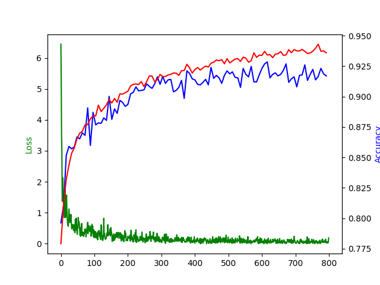
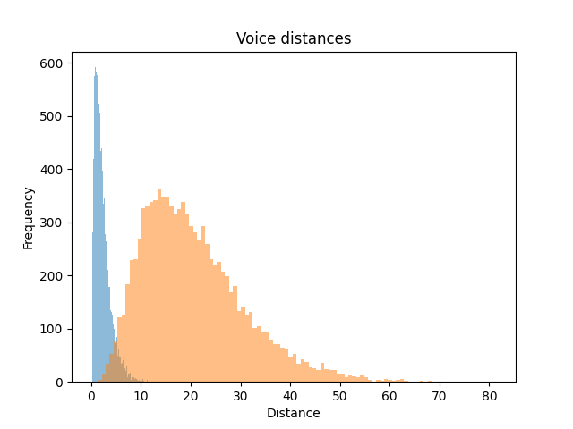

## Voice Verifier

We'll create a neural network to verify speakers.
Given two voice recordings A and B, the model will predict whether both voices belong to the same person or not.
Note that the two sets of speakers used for training and testing are disjoint.
Therefore, once trained, we expect the model to work with previously unheard speakers.

For this we will use Pytorch to create a siamese neural network.
This network is formed by a pair of identical sub-networks with the same weights.
Each sub-network processes one of the voice recordings in the pair to analyse and outputs a tensor.
The distance between those tensors is inversely proportional to the probability of belonging to different speakers.

Similar models exists to verify face images, fingerprints, handwritten signatures, etc.
For instance, some smartphones have a model trained to distinguish fingerprints;
in this way, a smartphone can grant access to a user by telling if a new fingerprint reading is similar enough to the one which was used to set it up. 

Get started by inspecting the notebook in [Github](./voice_verifier.ipynb) or execute it in [Google Colab](https://colab.research.google.com/github/hmontaner/voice_verifier/blob/main/voice_verifier.ipynb).

You'll be able to reach more than 90% accuracy!

